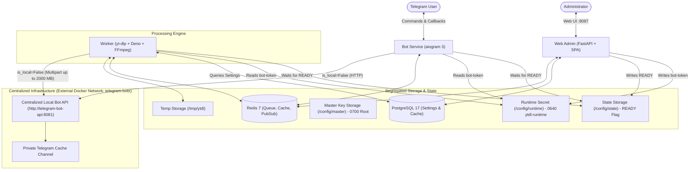

<div align="center">

# ⚡ Youtube Overdose

<p align="center">
  <b>A private, enterprise-grade Telegram bot & web administration suite for ultra-fast YouTube video downloads, studio-quality MP3 audio, and multilingual AI subtitles.</b>
</p>

<p align="center">
  
  
  
  
  
  
</p>

</div>

---

## 📖 Overview

**Youtube Overdose** is a self-hosted media platform that turns any Telegram chat into a private media downloading power station. Powered by **aiogram 3**, **FastAPI**, **yt-dlp**, and **FFmpeg**, it provides lightning-fast downloads, automatic hardware-friendly codec selection, and zero-storage cloud caching.

Unlike conventional downloaders that eat gigabytes of VPS storage, **Youtube Overdose** utilizes a **private Telegram channel as persistent media storage**. Videos and audios are processed and uploaded once; subsequent requests are delivered instantaneously via Telegram's native `copyMessage` without using server CPU, RAM, or bandwidth.

---

## ✨ Features

- ⚡ **Smart Automatic Codec Selection & Stream-Copy Engine**:
  - Automatically identifies whether streams can be losslessly copied (`-c copy`) without CPU transcoding.
  - Automatically selects the optimal Telegram-compatible codec container (AVC / H.264 or HEVC / H.265) without forcing users through confusing technical prompts.
  - Minimal CPU usage: Runs effortlessly on 1-2 core VPS instances.
- 🎯 **Dynamic 144p – 4K Resolution Filter**:
  - Dynamically extracts actual available video streams directly from YouTube.
  - Intelligently filters out broken, unplayable, or sub-144p formats.
  - Enforces exact requested height—never silently downgrades or upgrades user requests.
- 📱 **True 9:16 Vertical Video & High-Resolution Thumbnails**:
  - Native support for YouTube Shorts with accurate vertical 9:16 aspect ratio probes.
  - Highest-quality thumbnail extraction with automatic aspect-ratio-preserving padding and luminance analysis to prevent black bars or dark title frames.
  - Embeds authoritative `ffprobe` duration, width, and height before transmission (`supports_streaming=True`).
- 🎵 **Studio-Quality MP3 with ID3v2.3 Artwork**:
  - High-bitrate audio extraction strictly tagged with ID3v2.3 metadata (`TIT2` title, `TPE1` artist, `TALB` album, `TDRC` year).
  - High-resolution square `cover.jpg` (500×500) embedded as an `APIC` frame and passed directly to Telegram's audio player thumbnail.
  - Clean, sanitized filenames (`Artist - Title.mp3` or `Title.mp3`).
- 🛑 **Interactive Inline Cancel Button**:
  - Active downloads and queued tasks feature an inline **Cancel** button.
  - Users can cancel their jobs at any moment; active locks and temporary files are immediately cleaned up.
- 🧹 **Clean Chat Experience**:
  - Progress updates, queue indicators, and processing messages are automatically deleted once the final media file is delivered, keeping chats completely clean and clutter-free.
- 💬 **Multilingual AI Subtitle Translation**:
  - Extracts clean English SRT tracks (manual or auto-generated).
  - Translates subtitles to Persian (FA) or other target languages via any OpenAI-compatible API (OpenAI, OpenRouter, Groq, local LLMs) with strict timestamp preservation.
- 🚀 **Centralized Telegram Local Bot API (2000 MB Uploads)**:
  - Directly communicates with a centralized Local Bot API server over the Docker network `telegram-bots` at `http://telegram-bot-api:8081`.
  - Enables file uploads up to **2000 MB (2 GB)** via standard HTTP multipart streaming (`is_local=False`), without requiring shared volumes or host disk staging.
  - Dual-mode support: Seamlessly toggle between `cloud` mode (50 MB limit) and `local` mode (2000 MB limit).
- ☁️ **Permanent Zero-Disk Cloud Storage**:
  - Completed media is cached forever in a private Telegram channel.
  - Instant cache hits completely bypass the queue and workers.
  - All temporary files are purged from disk immediately after upload or cancellation.
- 🛡️ **Hardened Must-Join Channel Gate**:
  - Universal gate protecting `/start`, URL submission, and all media interactions.
  - Generates direct channel buttons and validates user membership in real-time.
  - Distinguishes user non-membership from bot permission errors (`CHANNEL_NOT_FOUND`, `BOT_INSUFFICIENT_PERMISSIONS`, etc.).
  - Whitelist system allows exempting specific users from the gate.
- 🍪 **Netscape YouTube Cookie Manager**:
  - Upload or paste `cookies.txt` via Web UI with Netscape format validation, atomic write, and zero-downtime hot reload.
- 🖥️ **Obsidian Dark Web Administration Suite**:
  - Modern, responsive dark UI on port `8087` protected by Argon2id authentication.
  - **Bot Messages**: Unified editor for Welcome (`/start`), Help (`/help`), and Must-Join message templates with HTML parse-mode validation.
  - **Engine & Limits**: Consolidated settings for media rules, file size limits, and storage quotas without duplicated inputs.
  - **Queue & Job Management**: Live progress monitoring with one-click "Clear Queue" and "Clear Jobs" actions.
  - **User Management**: Search users, ban/unban, view stats, and permanently delete users with cascading cleanup.
  - **System Diagnostics & Logs**: Real-time structured log streaming, service health checks, and Prometheus `/metrics`.

---

## 📱 User Experience Flow

```
User sends YouTube URL
        │
        ▼
[ Must-Join Channel Guard ] ──(Not Joined)──> [ Join Required Channels ]
        │ (Authorized)
        ▼
[ Fast Metadata & Stream Extraction ]
        │
        ▼
[ Thumbnail Photo Preview with Video Title ]
┌─────────────┬─────────────┐
│    1080p    │    720p     │
├─────────────┼─────────────┤
│    480p     │    360p     │
├─────────────┼─────────────┤
│   🎵 MP3    │ 💬 Subtitle │
└─────────────┴─────────────┘
        │
        ▼ (Single Tap Quality Selection)
[ Cache Check ] ──(Cache Hit)──> [ Instant copyMessage Delivery ]
        │ (Cache Miss)
        ▼
[ Redis Persistent FIFO Queue ] ──> [ Live Progress with ❌ Cancel Button ]
        │
        ▼
[ Smart Auto-Codec Engine (Stream-Copy or Hardware Transcode) ]
        │
        ▼
[ Upload to Private Telegram Cache Channel (Up to 2000 MB) ]
        │
        ▼
[ Deliver Media to User & Purge Progress Message (Clean Chat) ]
```

---

## 🏗️ System Architecture



---

## ⚙️ Minimum Hardware Requirements

| Component | Minimum | Recommended | Notes |
|---|---|---|---|
| **CPU** | 1 Core | 2 Cores | Stream-copy ensures low CPU footprint |
| **RAM** | 1 GB | 2 GB – 4 GB | Total stack memory usage is under 750 MB |
| **Storage** | 10 GB | 20 GB – 40 GB | Completed media is stored in Telegram cloud |
| **OS** | Linux | Ubuntu / Debian / Alpine | Any Docker-supported Linux distribution |

---

## 🚀 Quick Start & Deployment

### 1. Prerequisites
1. **Telegram Bot Token**: Create your bot via [@BotFather](https://t.me/BotFather).
2. **Private Cache Channel**:
   - Create a private channel in Telegram.
   - Add your bot as an **Administrator** with full posting permissions.
   - Obtain the numeric channel ID (e.g., `-1001234567890`).
3. **External Network (For Local Mode)**:
   - Ensure the external Docker network `telegram-bots` exists on your host:
     ```bash
     docker network create telegram-bots || true
     ```

---

### Option A: Deploy via Portainer (Recommended)

1. Open Portainer and go to **Stacks** -> **Add stack**.
2. Select **Repository** and specify:
   - **Repository URL**: `https://github.com/musicOverdose/YoutubeOverdoseBot.git`
   - **Repository reference**: `refs/heads/main`
   - **Compose path**: `docker-compose.yml`
3. In **Environment variables**, set:
   ```env
   WEB_HOST_PORT=8087
   ADMIN_USERNAME=admin
   ADMIN_PASSWORD=SetAStrongPasswordHere
   SECRET_KEY=generate_a_random_64_character_string
   MAX_ACTIVE_JOBS=1
   MAX_FILE_SIZE_MB=2000
   TELEGRAM_API_MODE=cloud
   TELEGRAM_API_BASE_URL=https://api.telegram.org
   ```
4. Click **Deploy the stack**.

---

### Option B: Deploy via Docker Compose CLI

```bash
# 1. Clone repository
git clone https://github.com/musicOverdose/YoutubeOverdoseBot.git
cd YoutubeOverdoseBot

# 2. Ensure external network exists
docker network create telegram-bots || true

# 3. Create environment configuration
cp .env.example .env
nano .env

# 4. Launch the stack
docker compose up -d --build

# 5. Monitor logs
docker compose logs -f
```

---

## 🎛️ Web Administration Panel

Access the dashboard at `http://<your-server-ip>:8087`.

```
┌─────────────────────────────────────────────────────────────┐
│ ⚡ Youtube Overdose Admin Suite                              │
├───────────────┬─────────────────────────────────────────────┤
│ 📊 Dashboard  │ Live CPU, RAM, Disk, Active & Queued jobs   │
│ ⏳ Queue      │ Real-time progress bars, speed, Clear Queue │
│ 📁 Jobs       │ Searchable job history, retry & Clear Jobs  │
│ ⚡ Cache       │ Browse cached media, stats, single delete   │
│ 👥 Users      │ User statistics, ban/unban, permanent delete│
│ 🔒 Must Join  │ Channel gates, membership verification      │
│ 💬 Messages   │ Consolidated Welcome, Help & Gate templates │
│ 🍪 Cookies    │ Netscape cookies.txt upload, test & reload  │
│ 🤖 AI Trans   │ OpenAI-compatible subtitle translation      │
│ ⚙️ Engine     │ Quality limits, storage quotas, file sizes  │
│ 🖥️ System     │ Container health checks, Prometheus /metrics│
│ 📝 Logs       │ Live structured system log streaming        │
│ 🛡️ Audit Log  │ Security audit trail of administrative ops  │
└───────────────┴─────────────────────────────────────────────┘
```

---

## 🔧 Environment Variables Reference

| Variable | Default | Description |
|---|---|---|
| `BOT_TOKEN` | *Optional* | Telegram Bot token (can be configured via Web Admin) |
| `TELEGRAM_CACHE_CHANNEL_ID` | *Optional* | Channel ID for permanent media cloud storage |
| `TELEGRAM_API_MODE` | `cloud` | Bot API mode: `cloud` (50MB) or `local` (2000MB) |
| `TELEGRAM_API_BASE_URL` | `https://api.telegram.org` | Bot API URL (`http://telegram-bot-api:8081` in local mode) |
| `WEB_HOST_PORT` | `8087` | Web admin host port (container: 8080) |
| `ADMIN_USERNAME` | `admin` | Admin login username |
| `ADMIN_PASSWORD` | *Required* | Initial admin password (hashed with Argon2id) |
| `ADMIN_PASSWORD_RESET` | `false` | Force reset database password from environment on startup |
| `SECRET_KEY` | *Auto* | Secret key for signing JWT session tokens |
| `MAX_ACTIVE_JOBS` | `1` | Global concurrent download limit |
| `MAX_CONCURRENT_PER_USER` | `1` | Max concurrent downloads per user |
| `MAX_FILE_SIZE_MB` | `2000` | Max media download size in MB |
| `MAX_TEMP_STORAGE_GB` | `30` | Safety threshold for temporary disk storage |
| `DEFAULT_MAX_HEIGHT` | `1080` | Default maximum video resolution limit |
| `PLAYLISTS_ENABLED` | `false` | Enable or disable playlist downloads |
| `AI_ENABLED` | `false` | Enable AI subtitle translation |
| `AI_PROVIDER` | `openai` | AI translation provider (`openai`, `openrouter`, etc.) |
| `AI_BASE_URL` | `https://api.openai.com/v1` | OpenAI-compatible endpoint URL |
| `AI_MODEL` | `gpt-4o-mini` | Language model for subtitle translation |
| `AI_MAX_CHUNKS` | `20` | Max subtitle chunks (0 = unlimited) |

---

## 🧪 Automated Testing

Run the automated test suite locally:

```bash
# Run tests
pytest tests/
```

Test coverage includes:
- **Smart Codec Selection & Video Thumbnails**: Stream-copy decision logic, 9:16 vertical aspect ratio detection, and high-resolution thumbnail generation.
- **Resolution Filtering**: 144p–4K dynamic filtering with exact height enforcement.
- **Cancel Button & Clean Chat**: Inline task cancellation and progress message purging.
- **Centralized Local Bot API**: Dual-mode client with 50 MB / 2000 MB payload thresholds.
- **Rich MP3 Metadata**: ID3v2.3 tag verification and square cover embedding.
- **Queue & Storage Safety**: Transaction-safe queue clearing, job history purging, and cascading user deletion.
- **Must-Join Security**: Channel membership verification and action recovery.
- **Web Admin Integration**: Bot message template persistence and settings API.

---

## 📄 License

This project is licensed under the [MIT License](LICENSE).
