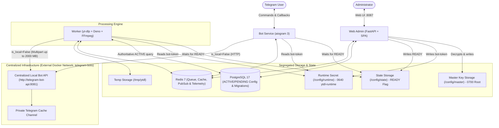

<div align="center">

# 🎬 Telegram YouTube Downloader

<p align="center">
  <b>A private, high-performance Telegram bot & web administration suite for downloading YouTube videos, MP3 audio, and multilingual subtitles with AI-powered translation.</b>
</p>

<p align="center">
  
  
  
  
  
  
</p>

</div>

---

## 📖 Overview

**Telegram YouTube Downloader** is a self-hosted solution that turns any Telegram chat into a private media downloader. Built with **aiogram 3**, **FastAPI**, **yt-dlp**, and **FFmpeg**, it provides a streamlined user experience, intelligent CPU optimization, and persistent cloud caching.

Unlike conventional downloaders that consume gigabytes of server storage, this system utilizes a **private Telegram channel as persistent media storage**. Completed media is uploaded once and cached forever; subsequent requests are delivered in milliseconds using Telegram's native `copyMessage` without consuming server CPU, RAM, or bandwidth.

---

## ✨ Features

- 🚀 **Centralized Telegram Local Bot API (2000 MB Uploads)**:
  - Connects to an independent, centralized Telegram Local Bot API server running on the external Docker network `telegram-bots` at `http://telegram-bot-api:8081`.
  - **Decoupled Client Architecture**: The bot does not build, bundle, or run an embedded Bot API container, eliminating duplicate servers and removing `TELEGRAM_API_ID` and `TELEGRAM_API_HASH` requirements entirely.
  - **Standard HTTP Multipart Uploads**: Uploads media using aiogram with `is_local=False` directly over Docker bridge networking up to **2000 MB (2 GB)** without requiring shared `/transfer` filesystem volumes or host disk staging.
  - **Dual Mode Support**: Toggleable between `cloud` mode (default: `https://api.telegram.org`, 50 MB limit) and `local` mode (`http://telegram-bot-api:8081`, 2000 MB limit) via environment variables or Web Admin panel.
- 🎵 **Enhanced MP3 Audio & Rich ID3v2.3 Metadata**:
  - Full ID3v2.3 tag embedding (`TIT2` title, `TPE1` artist, `TALB` album, `TDRC` year, `APIC` cover) strictly applied and verified with Mutagen.
  - Generates aspect-ratio-preserving square `cover.jpg` (500x500 via Pillow) embedded as `APIC` frame in the MP3 and attached as `thumbnail=FSInputFile(cover_jpg_path)` in Telegram `send_audio()`.
  - Clean, sanitized output filenames (`Artist - Title.mp3` or `Title.mp3`).
- 🎬 **Authoritative Video Delivery Metadata & Thumbnails**:
  - Probes final processed output files with `ffprobe` to extract authoritative `duration`, `width`, and `height` before delivery (never relies on original YouTube estimates or Telegram client-side inference).
  - Automatically generates aspect-ratio-preserving JPEG thumbnails ($\le 320\times 320$, strictly $< 200\text{ KB}$) from the final output video with luminance probing to avoid black title cards.
  - Uploads with explicit metadata, `supports_streaming=True`, and attached thumbnail.
- 🎯 **Quality-First Telegram UX**:
  - Dynamically detects actual available resolutions directly from YouTube streams (`2160p`, `1440p`, `1080p`, `720p`, `480p`, `360p`).
  - Previews send the video thumbnail with only the **Video Title** as caption.
  - Initial menu presents source resolutions, `🎵 MP3`, and `💬 Subtitle`.
- 🔒 **Strict Exact Resolution**:
  - Enforces exact requested height (`height == requested_height`). Never silently downgrades or upgrades quality.
- 🎬 **Two-Step Codec Selection**:
  - Resolution is selected first, followed by clean options: `🎬 H.264 / AAC`, `📦 H.265 / AAC`, and `⬅️ Back`.
- ⚡ **Zero Unnecessary Transcoding (CPU Optimized)**:
  - Probes streams with `ffprobe` and prefers stream copying (`-c copy`) whenever the source already matches target codecs. Runs smoothly on minimal 1-2 core VPS instances.
- ☁️ **Private Telegram Cache**:
  - Persistent storage in a private Telegram channel. Cache hits bypass workers and queues entirely.
- 🧹 **Zero Permanent Disk Waste**:
  - Temporary files are automatically purged after verified cache upload, failure, or cancellation.
- 🛡️ **Hardened Must-Join Channel Gate & Safe UX**:
  - Universal gate protecting `/start`, YouTube URL submission, and all media interactions (quality, codec, audio, subtitle).
  - Generates direct URL buttons for configured channels (`https://t.me/...` or invite links) and explicit fallback alerts for missing links.
  - Secure fixed callback `must_join:check` ("I Joined — Check Again") backed by a server-side pending action store (user/chat bound, 15-minute TTL, single-use atomic consumption).
  - Distinguishes user non-membership from bot permission/API errors (`CHANNEL_NOT_FOUND`, `BOT_INSUFFICIENT_PERMISSIONS`, `BOT_NOT_MEMBER`, `TELEGRAM_API_ERROR`).
  - Customizable template message with `{first_name}` and `{channel_list}` placeholders with strict Telegram HTML parse-mode validation and escaping.
- 🚦 **Persistent Queue & Concurrency Control**:
  - Redis-backed FIFO queue surviving container restarts.
  - Race-safe concurrency slot allocation via Redis Lua scripts.
  - Real-time derived queue positions for users (`#1`, `#2`...).
- 👥 **Duplicate Job Coalescing**:
  - Multiple users requesting the same video share a single underlying processing job and queue slot.
- 💬 **Subtitles with AI Translation**:
  - Clean English SRT extraction (auto-generated or manual).
  - Persian AI subtitle translation using any OpenAI-compatible API endpoint with strict timestamp preservation.
- 🍪 **YouTube Cookies Manager**:
  - Upload or paste `cookies.txt` with Netscape format validation, atomic write, and hot-reload.
- 🔐 **Least-Privilege Security Architecture & State Invariants**:
  - **Worker isolation**: Worker has no access to `master.key` or PostgreSQL decryption; reads `bot-token` strictly from a restricted Unix group runtime volume (`0640`, group `ytdl-runtime` GID 1001) with zero `.env` credential fallback.
  - **Universal readiness gating**: Both Bot Service long-polling and Worker job dequeuing strictly gate on `/config/state/READY`. If `READY` is absent during reconciliation or mutations, services idle safely.
  - **Non-blocking session advisory lock**: `pg_try_advisory_lock(73541629)` on a dedicated session connection with explicit autobegin rollback prevents concurrent configuration collisions with instant HTTP 409 Conflict.
  - **Cloud ➔ Local migration state machine**: Dedicated `telegram_migrations` singleton table (`CHECK (id = 1)`) manages non-atomic cloud `logOut()`. Categorizes timeouts, HTTP 429, and 5xx as `CLOUD_LOGOUT_UNKNOWN`, respecting Telegram's 10-minute cooldown.
  - **Authoritative configuration reads**: Worker and Bot query `Setting` records directly from PostgreSQL for every job/poll, backed by Redis Pub/Sub invalidation and a 30-second drift heartbeat.
  - **Strict 5-step cache channel validation**: Probes channel eligibility via `getChat` and `getChatAdministrators` checking `can_post_messages` without intrusive `sendChatAction` calls.
  - **Service-reported telemetry**: Worker reports disk metrics into Redis; no cross-service storage volume mounts into Web Admin.
- 🖥️ **Full Web Administration Panel**:
  - Modern, responsive dark SaaS dashboard on host port `8087` (container port `8080`) protected by Argon2id authentication.
  - **Queue & Job Management**: Instant "Clear Queue" button (`POST /api/queue/clear`) to cancel waiting jobs safely without touching active jobs, and "Clear Jobs" button (`POST /api/jobs/clear`) to purge finished job history.
  - **User Management & Cascading Deletion**: User list with job statistics, ban/unban toggles, and "Delete User" button (`DELETE /api/users/{user_id}`) with full cascading deletion across user records, job requests, and logs.
  - **Telegram Configuration**: Decoupled dual-mode management (`cloud` vs `local`) with live API testing and hot reloading without requiring Telegram API ID/Hash.
  - **Must-Join Management & Whitelist**: Enforce channel membership with live verification, custom welcome & gate messages, and exempt user whitelist.
  - **Download Size Limit Controls**: Dynamic download file size limits (`MAX_FILE_SIZE_MB`) and temporary disk safety thresholds.

---

## 📱 User Experience Flow

```
User sends YouTube URL
        │
        ▼
[ Must-Join Channel Guard ] ──(Missing channel)──> [ Join Required Channels ]
        │ (Authorized)
        ▼
[ Metadata Extraction & Duration Check ]
        │
        ▼
[ Thumbnail Photo Preview ]
Caption: VIDEO TITLE ONLY
┌─────────────┬─────────────┐
│    1080p    │    720p     │
├─────────────┼─────────────┤
│    480p     │    360p     │
├─────────────┼─────────────┤
│   🎵 MP3    │ 💬 Subtitle │
└─────────────┴─────────────┘
        │
        ▼ User selects "1080p"
[ Seamless Menu Edit ]
┌───────────────────────────┐
│      🎬 H.264 / AAC       │
├───────────────────────────┤
│      📦 H.265 / AAC       │
├───────────────────────────┤
│          ⬅️ Back          │
└───────────────────────────┘
        │
        ▼ User selects codec
[ Cache Lookup ] ──(Cache Hit)──> [ Instant copyMessage Delivery ]
        │ (Cache Miss)
        ▼
[ Redis Persistent FIFO Queue ] ──> [ Live Status Message (⬇️ Downloading 64%...) ]
        │
        ▼
[ FFmpeg Processing (Stream-Copy or Transcode) ]
        │
        ▼
[ Upload to Private Telegram Cache Channel ]
        │
        ▼
[ Deliver to User(s) & Delete Local Temp File ]
```

---

## 🏗️ System Architecture



### 🔐 Telegram Runtime Consistency & State Invariants

The Telegram integration is engineered around strict operational consistency and least-privilege security invariants:

1. **The `/config/state/READY` Invariant**:
   - **File presence guarantees consistency**: The presence of `/config/state/READY` guarantees that filesystem runtime artifacts strictly match the authoritative `ACTIVE` configuration in PostgreSQL (`config_version = N`).
   - **Universal consumer gating**: Both **Bot Service** (long-polling loop) and **Worker** (job dequeuing in `acquire_next_job()`) check for the existence of `READY`.
   - **Graceful pause**: If `READY` is unlinked during reconciliation or mutations, Bot polling and Worker job acquisition safely idle without crashing or dropping state.

2. **Least-Privilege Credential Isolation**:
   - **Filesystem Permissions**: The runtime bot token `/config/runtime/bot-token` is generated by Web Admin with mode `0640`, owned by Web Admin runtime user and Unix group `ytdl-runtime` (GID `1001`).
   - **Zero Secret Fallback**: Worker and Bot run with supplementary GID `1001` and read the bot token strictly from this volume. Neither service has access to `master.key` or PostgreSQL decryption keys, and production builds strictly disallow `.env` secret fallbacks.

3. **Decoupled Centralized Local Bot API Integration**:
   - **No Embedded Container**: The bot is purely an HTTP client connected to the centralized Local Bot API server over the shared `telegram-bots` Docker bridge network. It does not run its own Local Bot API daemon, eliminating container supervisor processes and restart triggers.
   - **No API ID / API Hash Required**: Because the centralized server handles Telegram MTProto upstream authentication, this bot client only requires the bot token and the base URL (`http://telegram-bot-api:8081`).
   - **Standard HTTP Multipart (`is_local=False`)**: Files up to 2000 MB are streamed via standard HTTP multipart upload using aiogram directly to the local server endpoint, eliminating shared volume dependencies.

4. **Session-Level Non-Blocking Advisory Locking**:
   - Web Admin acquires `pg_try_advisory_lock(73541629)` on a dedicated connection to prevent concurrent admin configuration modifications, returning HTTP 409 Conflict immediately on contention.
   - Because SQLAlchemy 2.0 `conn.scalar()` automatically opens an implicit transaction block (autobegin), an explicit `await conn.rollback()` is executed immediately after acquiring the lock. This clears the transaction block while retaining the session-level lock, ensuring long-running external HTTP probes do not hold open an idle PostgreSQL transaction.

5. **Safe Production Migration Sequence**:
   - When migrating an existing bot instance between Local Bot API instances or from Cloud, Telegram sessions must never be abruptly broken.
   - **No Automatic `logOut`**: Application code never issues automated `logOut()` calls.
   - A step-by-step verified procedure is documented in [Centralized Local Bot API Migration Guide](docs/MIGRATION_CENTRALIZED_LOCAL_BOT_API.md).

6. **Strict 5-Step Cache Channel Validation**:
   - Channel verification executes five non-intrusive Telegram API calls: `getChat`, `getChatAdministrators`, checks administrator status, verifies `can_post_messages` permission bit, and confirms chat type is `channel` or `supergroup`.
   - Never invokes intrusive `sendChatAction` calls.

7. **Authoritative Configuration Reads & Resilient Uploads**:
   - The Worker queries `Setting` records directly from PostgreSQL for each job execution (mode, channel ID, configuration version).
   - Uploads feature a 3-attempt exponential retry loop to gracefully withstand transient connection resets.

---

## ⚙️ Minimum Hardware Requirements

| Component | Minimum | Recommended | Notes |
|---|---|---|---|
| **CPU** | 1 Core | 2 Cores | `MAX_ACTIVE_JOBS=1` default ensures stability |
| **RAM** | 1 GB | 2 GB – 4 GB | Combined memory consumption is under 800 MB |
| **Storage** | 10 GB | 20 GB – 50 GB | Completed media is stored in Telegram cache |
| **OS** | Linux | Debian / Ubuntu / Alpine | Any Docker-supported distribution |

---

## 🚀 Quick Start & Deployment

### 1. Prerequisites
1. **Telegram Bot Token**: Create a bot via [@BotFather](https://t.me/BotFather).
2. **Private Cache Channel**:
   - Create a private channel in Telegram.
   - Add your bot as an **Administrator** with full posting permissions.
   - Retrieve the numeric channel ID (e.g., `-1001234567890`) using [@JsonDumpBot](https://t.me/JsonDumpBot) or [@username_to_id_bot](https://t.me/username_to_id_bot).
3. **External Network (For Local Mode)**:
   - Ensure the external Docker network `telegram-bots` exists on your Docker host (`docker network create telegram-bots`) with your centralized Local Bot API server running at `http://telegram-bot-api:8081`.

---

### Option A: Deploy via Portainer (Recommended)

1. Open Portainer and navigate to **Stacks** -> **Add stack**.
2. Select **Repository** and enter:
   - **Repository URL**: `https://github.com/musicOverdose/YoutubeOverdoseBot.git`
   - **Repository reference**: `refs/heads/main`
   - **Compose path**: `docker-compose.yml`
3. In the **Environment variables** section, define:
   ```env
   # Web Admin Host Port (defaults to 8087, forwarding to container port 8080)
   WEB_HOST_PORT=8087
   ADMIN_USERNAME=admin
   ADMIN_PASSWORD=SetAStrongPasswordHere
   SECRET_KEY=generate_a_random_64_character_string
   MAX_ACTIVE_JOBS=1
   MAX_FILE_SIZE_MB=2000
   TELEGRAM_API_MODE=cloud
   TELEGRAM_API_BASE_URL=https://api.telegram.org
   ```
   *(Telegram bot credentials can also be configured and managed dynamically via the Web Admin Panel)*
4. Click **Deploy the stack**.

---

### Option B: Deploy via Docker Compose CLI

```bash
# 1. Clone repository
git clone https://github.com/musicOverdose/YoutubeOverdoseBot.git
cd YoutubeOverdoseBot

# 2. Ensure external telegram-bots network exists
docker network create telegram-bots || true

# 3. Setup configuration
cp .env.example .env
nano .env

# 4. Launch stack
docker compose up -d --build

# 5. View real-time logs
docker compose logs -f
```

---

## 🎛️ Web Administration Panel

Access the dashboard at `http://<your-server-ip>:8087`.

```
┌─────────────────────────────────────────────────────────────┐
│ ⚡ YTDL Management Console                                   │
├───────────────┬─────────────────────────────────────────────┤
│ 📊 Dashboard  │ Live CPU, RAM, Disk, Active & Queued counts │
│ ⏳ Queue      │ Live progress bars, speed, ETA, Clear Queue │
│ 📁 Jobs       │ Filterable job history, retry & Clear Jobs  │
│ ⚡ Cache       │ Inspect cached items, hit stats, delete     │
│ 👥 Users      │ User list, job statistics, ban, Delete User │
│ 🔒 Must Join  │ Enforce channel membership, bot status test │
│ 💬 Welcome    │ Editable /start message with HTML safety    │
│ 📺 YouTube    │ Default resolutions, playlist limits        │
│ 🍪 Cookies    │ Netscape cookies.txt upload, paste, test    │
│ 🤖 AI Trans   │ OpenAI-compatible subtitle translation      │
│ ⚙️ Settings   │ Max file size limit, safety controls        │
│ 🖥️ System     │ Service health, Prometheus /metrics         │
│ 📝 Logs       │ Real-time structured system logs            │
│ 🛡️ Audit Log  │ Security audit trail of admin actions       │
└───────────────┴─────────────────────────────────────────────┘
```

---

## 🔧 Environment Variables Reference

| Variable | Default | Description |
|---|---|---|
| `BOT_TOKEN` | *Optional / Web Admin* | Telegram Bot token (configurable via Web Admin) |
| `TELEGRAM_CACHE_CHANNEL_ID` | *Optional / Web Admin* | Channel ID for permanent media cache |
| `TELEGRAM_API_MODE` | `cloud` | Bot API connection mode: `cloud` or `local` |
| `TELEGRAM_API_BASE_URL` | `https://api.telegram.org` | Base URL for Telegram Bot API (`http://telegram-bot-api:8081` in local mode) |
| `WEB_HOST_PORT` | `8087` | Web administration panel host port (container: 8080) |
| `ADMIN_USERNAME` | `admin` | Administrator login username |
| `ADMIN_PASSWORD` | *Required on fresh install* | Initial administrator login password (hashed with Argon2id) |
| `ADMIN_PASSWORD_HASH` | *None* | Precomputed Argon2id hash for admin password |
| `ADMIN_PASSWORD_RESET` | `false` | Set to `true` to reset DB password from env on startup |
| `SECRET_KEY` | *Auto* | Secret key for signing session tokens |
| `MAX_ACTIVE_JOBS` | `1` | Global concurrent processing limit |
| `MAX_CONCURRENT_PER_USER` | `1` | Max concurrent jobs per user |
| `MAX_FILE_SIZE_MB` | `2000` | Max video/audio download size in MB (50 MB in cloud mode) |
| `CACHE_HIT_BYPASSES_DURATION_LIMIT` | `true` | Deliver cached videos even if over size limit |
| `MAX_TEMP_STORAGE_GB` | `30` | Safety limit for temporary storage |
| `DEFAULT_MAX_HEIGHT` | `1080` | Default maximum video resolution |
| `PLAYLISTS_ENABLED` | `false` | Enable/disable playlist downloads |
| `AI_ENABLED` | `false` | Enable Persian AI translation |
| `AI_PROVIDER` | `openai` | AI translation provider |
| `AI_BASE_URL` | `https://api.openai.com/v1` | OpenAI-compatible endpoint |
| `AI_MODEL` | `gpt-4o-mini` | Model for subtitle translation |
| `AI_MAX_CHUNKS` | `20` | Max chunks for subtitle translation (0 = unlimited) |

---

## 💾 Backup Guidelines

| Asset | Backup Required? | Description |
|---|---|---|
| **PostgreSQL Database** | **YES** | Contains user history, channel configs, cache records, and audit logs |
| **Environment Configuration** | **YES** | `.env` credentials and configuration |
| **Media Files** | **NO** | Completed media is permanently preserved in the private Telegram cache channel |

### Automated Database Backup (Cron Example)
```bash
0 3 * * * docker exec ytdl_postgres pg_dump -U ytdl_user ytdl_db | gzip > /backups/ytdl_db_$(date +\%F).sql.gz
```

---

## 🧪 Testing

The repository contains a comprehensive 175-test automated test suite (169 passed, 6 PostgreSQL-backed skipped locally without live DB):

```bash
# Run complete test suite:
pytest -v
```

Tests cover:
- **Centralized Local Bot API & Dual-Mode Client**:
  - aiogram client with `is_local=False` connecting over Docker network
  - Toggleable `cloud` vs `local` mode with strict 50 MB / 2000 MB payload thresholds
  - Removal of `API_ID` and `API_HASH` credential dependencies across all layers
  - Safe migration documentation verification
- **Rich MP3 Metadata & Audio Delivery**:
  - ID3v2.3 tag embedding (`TIT2`, `TPE1`, `TALB`, `TDRC`, `APIC`) strictly verified with Mutagen
  - 500x500 square thumbnail generation and dual usage: embedded `APIC` frame + Telegram `send_audio(thumbnail=...)`
  - Sanitized audio filenames (`Artist - Title.mp3` or `Title.mp3`)
- **Queue, Job History, and User Cascade Controls**:
  - Transaction-safe queue clearing (`POST /api/queue/clear`) preserving active jobs in DB & Redis
  - Guarded job history purging (`POST /api/jobs/clear`) never affecting active or waiting jobs
  - User deletion cascading (`DELETE /api/users/{user_id}`) across user records, job requests, and logs
- **Video Delivery Metadata & Thumbnails**:
  - `ffprobe` metadata extraction against final processed video files (`duration`, `width`, `height`)
  - Aspect-ratio-preserving JPEG thumbnail generation bounded to $\le 320\times 320$ and $< 200\text{ KB}$
  - Black title-card fallback with luminance probing
  - Worker pipeline resilience ensuring video delivery even if thumbnail generation fails
- **Hardened Must-Join Channel Gate & Security**:
  - Gate coverage on `/start`, URL submission, quality/codec selection, audio extraction, and subtitle requests
  - Channel error distinction (`NOT_MEMBER`, `CHANNEL_NOT_FOUND`, `BOT_INSUFFICIENT_PERMISSIONS`, `BOT_NOT_MEMBER`, `TELEGRAM_API_ERROR`)
  - Server-side pending action store with user/chat binding, 15-minute TTL, and atomic one-time consumption
  - Exempt users whitelist matching by user ID or username
- **Non-Blocking Advisory Locking & Transaction State Machine**:
  - `pg_try_advisory_lock(73541629)` immediate HTTP 409 Conflict under concurrency
  - Explicit rollback of SQLAlchemy 2.0 autobegin clearing implicit transactions while retaining session lock
  - Startup reconciliation and universal readiness gating (`/config/state/READY`) for Bot and Worker
- **Security & Secret Management**:
  - Fernet master key generation fail-safe against pre-existing encrypted PostgreSQL rows
  - Secret masking and log redaction for `/bot<token>/`
  - Strict Unix file permission enforcement (`0640` group `ytdl-runtime`, `0644` state)
  - Argon2id password hashing and session token verification
- **Media Processing & Business Logic**:
  - Dynamic quality extraction & descending order
  - Stream copy vs. transcoding decision logic (zero unnecessary transcode)
  - Subtitle normalization & strict SRT validation
  - Deterministic cache key generation & cache invalidation
  - Redis FIFO queue ordering & derived position calculation
  - Concurrency race-safety with atomic Lua scripts
  - Cookie Netscape format validation & atomic file writes

---

## 📄 License

This project is licensed under the [MIT License](LICENSE).
